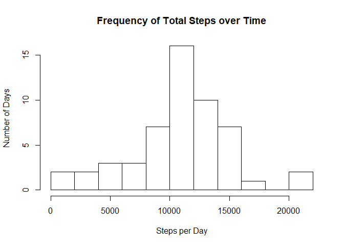
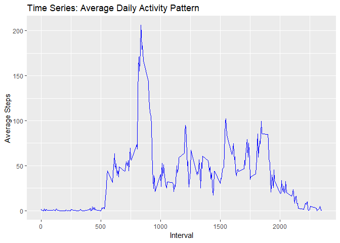
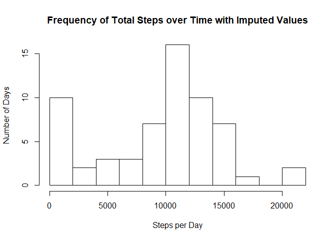
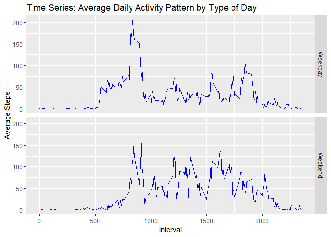

```r
knitr::opts_chunk$set(echo = TRUE)
```

## Loading and preprocessing the data


```r
## LIBRARIES

library(dplyr)
```

```
## 
## Attaching package: 'dplyr'
```

```
## The following objects are masked from 'package:stats':
## 
##     filter, lag
```

```
## The following objects are masked from 'package:base':
## 
##     intersect, setdiff, setequal, union
```

```r
library(ggplot2)
```

```
## Registered S3 methods overwritten by 'ggplot2':
##   method         from 
##   [.quosures     rlang
##   c.quosures     rlang
##   print.quosures rlang
```

```r
## READ DATA

data <- read.csv(unz("activity.zip", "activity.csv"))

## SORT DATA AND CHANGE TO DATE CLASS

data <- data %>% select(date, interval, steps)

data$date <- as.Date(data$date, "%Y-%m-%d")
```

## What is mean total number of steps taken per day?


```r
## Creates step sums for intervals and removes NA's

sum_data <- aggregate(steps ~ date,
          data,
          FUN = sum,
          na.action = na.omit)

colnames(sum_data) <- c("date", "stepsPerDay")

## Create histogram

hist(sum_data$stepsPerDay,
     xlab = "Steps per Day",
     ylab = "Number of Days",
     main = "Frequency of Total Steps over Time",
     breaks = 8)
```

<!-- -->

```r
## Calculate mean and median and print result

partone <- sum_data %>% summarize(mean = mean(stepsPerDay), median = median(stepsPerDay))
print(partone)
```

```
##       mean median
## 1 10766.19  10765
```

Mean and Median values are **10766.19** and **10765** respectively.

## What is the average daily activity pattern?


```r
## 

intervalData <- data %>%
  group_by(interval) %>%
  summarize(avgIntervalSteps = mean(steps, na.rm = TRUE))

ggplot(intervalData, aes(x = interval, y = avgIntervalSteps)) +
        geom_line(color = "blue") +
        ggtitle("Time Series: Average Daily Activity Pattern") +
        xlab("Interval") +
        ylab("Average Steps")
```

<!-- -->


```r
print(intervalData$interval[which.max(intervalData$avgIntervalSteps)])
```

```
## [1] 835
```
The interval with the maximum value of average steps is **835**.

## Imputing missing values


```r
sum(is.na(data))
```

```
## [1] 2304
```
The number of missing value in this data set is **2304**.

The strategy is to replace NA values with the median value for the 5 minute intervals in question.

```r
imputedSteps <- ifelse(is.na(data$steps),
                      ave(data$steps,
                          data$interval,
                          FUN = function(x) {median(x, na.rm = TRUE)}),
                      data$steps)

imputedData <- data %>% mutate(steps = imputedSteps)

imputedSums <- imputedData %>%
        group_by(date) %>%
        summarize(stepsPerDay = sum(steps))

hist(imputedSums$stepsPerDay,
     xlab = "Steps per Day",
     ylab = "Number of Days",
     main = "Frequency of Total Steps over Time with Imputed Values",
     breaks = 8)
```

<!-- -->

```r
imputedPart <- imputedSums %>% summarize(altMean = mean(stepsPerDay), altMedian = median(stepsPerDay))

print(imputedPart)
```

```
## # A tibble: 1 x 2
##   altMean altMedian
##     <dbl>     <int>
## 1   9504.     10395
```

**Original:**  
* mean: 10766.19  
* median: 10765  

**Imputed:**  
* mean: 10766.19  
* median: 10766.19  

**Negligible impact**

## Are there differences in activity patterns between weekdays and weekends?


```r
dayType <- weekdays(imputedData$date, abbreviate = TRUE)
dayType <- factor(dayType,
                  levels = c("Mon", "Tue", "Wed", "Thu", "Fri", "Sat", "Sun"),
                  labels = c("Weekday", "Weekday", "Weekday", "Weekday", "Weekday", "Weekend", "Weekend"))

imputedData$dayType <- dayType

dayData <- imputedData %>%
  group_by(dayType, interval) %>%
  summarize(avgIntervalSteps = mean(steps))

ggplot(dayData, aes(x = interval, y = avgIntervalSteps)) +
        geom_line(color = "blue") +
        facet_grid(dayType~.) +
        ggtitle("Time Series: Average Daily Activity Pattern by Type of Day") +
        xlab("Interval") +
        ylab("Average Steps")
```

<!-- -->
